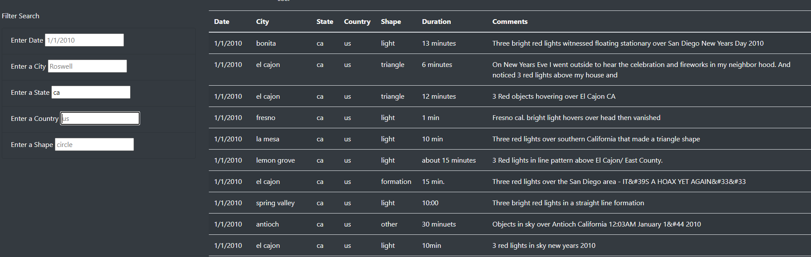

# UFOs

## Project Overview
The purpose of this project is to assist Dana in creating a website that displays data of UFO sightings. Here, we are provided a data file that houses information about UFO sightings. We are then to build a website using HTML and javascript that will display the data to the user based on certain filters that the user applies to the data set. 

## Results/Summary
Initially in building the site we only had a filter in place for the date. In its current state, we have added other fields to filter on such as city, state, country, and shape of the object sighted. Below is an example image of what our data looks like with the state filter applied.

Whenever a user adds information to one of these filter fields, upon highlighting a different field the app.js file runs through the filter list then truncates the data based on the filter input. While this method ultimately works, in my personal opinion I prefer that we use a button on this site to retrieve the data as users enter information. This is purely from a user UI perspective - the lack of an action button may lead the user to be confused at first as to wondering how the website filters their inputs if there's no action button present. Yeah, we could explain how the filter works but it should be intuitive enough out the door that it doesn't require an explanation. 

To improve this site, I suggest that regex be applied to the dataset to ensure all inputs are consistent. The main column that would benefit from this the most would be the duration column. The duration of the event is expressed in many different ways - if standardized this could also make for a viable column to also filter on. My other bit of feedback, add a condition to the filter such that it can also accept upper case letters in the filter input. For example, if I put in `CA` instead of `ca` I will receive no results. The filters should be more agile in handling user inputs.

Other than that, we have a working site that can help users get the info they need if they are curious about UFO sightings in their area. 
